游戏动画效果
===
```
本页面效果可使用以下命令调用；部分代码也能用来设置安全区(StartPoint.txt)的光圈。

脚本命令：Mobfireburn A B C D E F
A=地图号
B=X
C=Y
D=代码
E=持续时
F=伤害
```


|                        |        |
| ---------------------- | ------ |
| **效果**                 | **代码** |
| 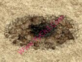    | 1      |
|     | 4      |
| 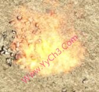    | 5      |
|     | 7      |
| 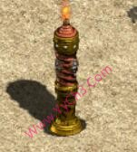    | 8      |
|     | 9      |
| 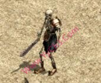   | 10     |
| 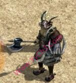   | 11     |
| 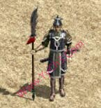   | 12     |
| 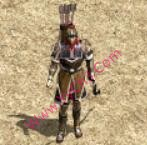   | 13     |
| 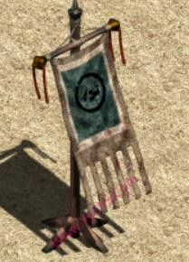   | 14     |
| 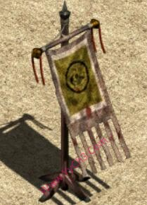   | 15     |
| 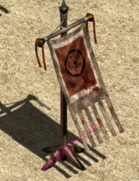   | 16     |
| 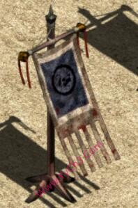   | 17     |
|    | 18     |
|    | 19     |
| 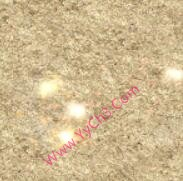   | 20     |
| 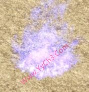   | 21     |
| 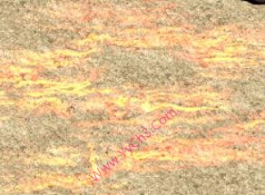   | 22     |
| 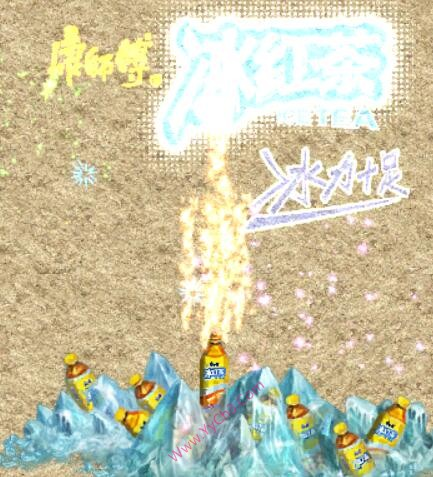   | 24     |
| 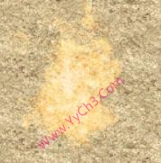   | 25     |
| 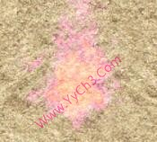   | 26     |
| 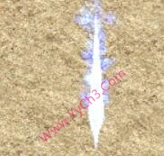   | 27     |
|    | 28     |
|    | 29     |
| 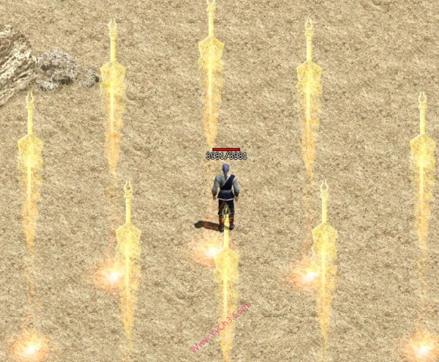   | 31     |
| 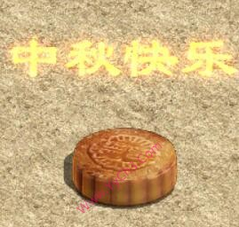   | 70     |
| 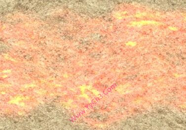   | 72     |
| 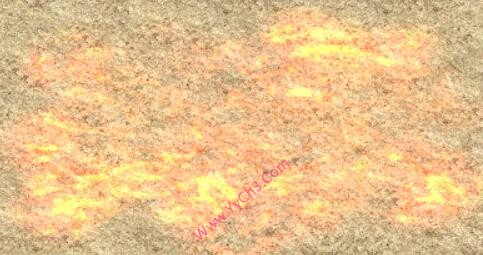   | 73     |
| 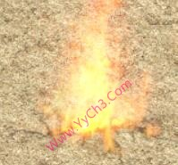   | 74     |
| 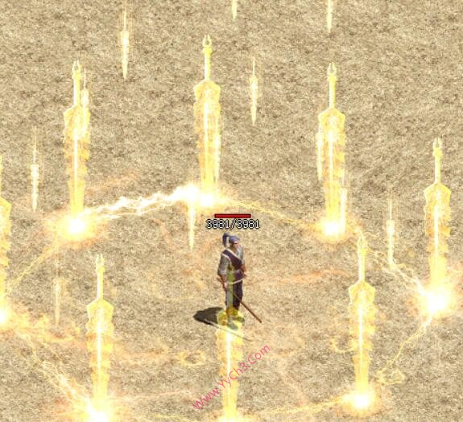   | 75     |
| 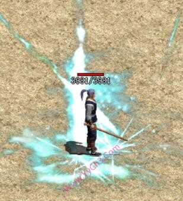   | 76     |
| 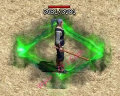   | 77     |
| 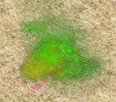   | 78     |
|    | 79     |
|    | 80     |
| 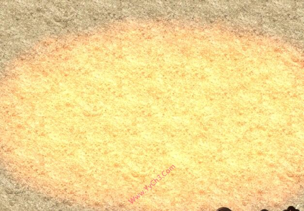   | 81     |
| 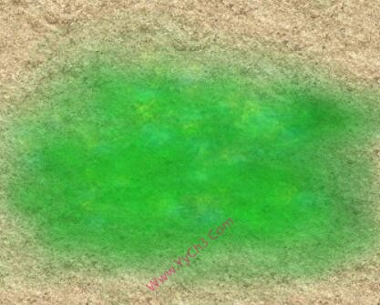   | 82     |
|    | 83     |
| 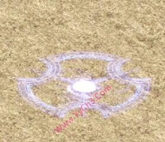   | 84     |
|    | 85     |
| 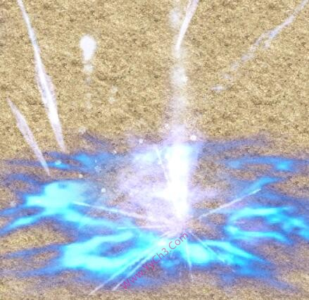   | 86     |
| 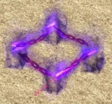   | 87     |
| 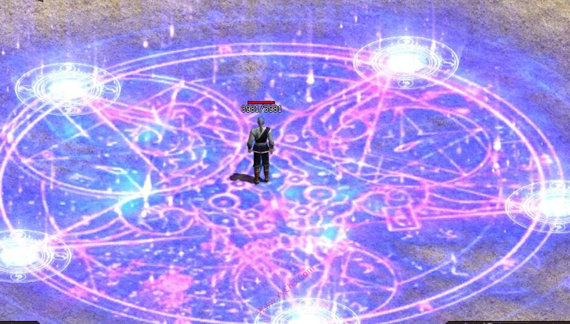   | 88     |
| 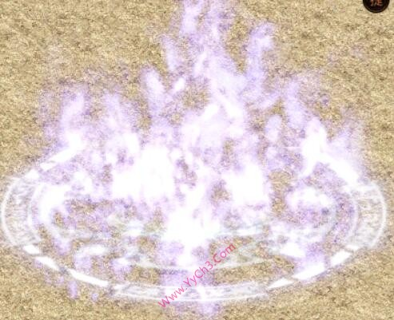   | 89     |
| 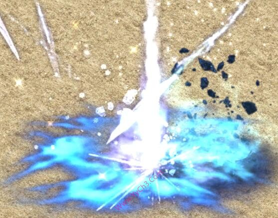   | 90     |
| 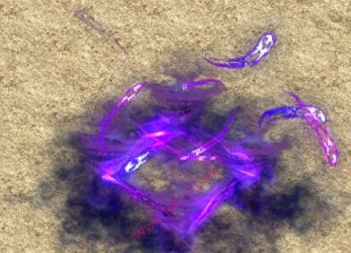   | 91     |
| 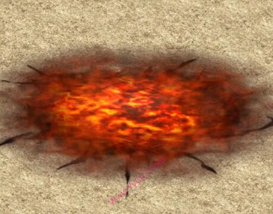   | 92     |
| 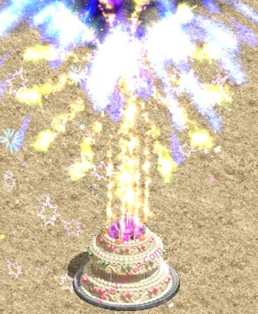   | 93     |
| 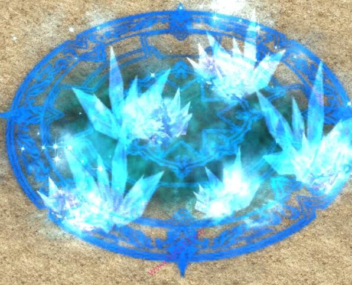   | 94     |
| 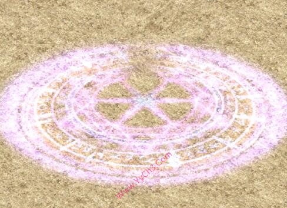   | 95     |
| 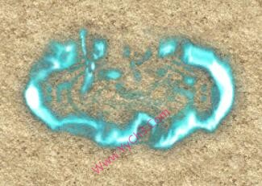   | 96     |
| 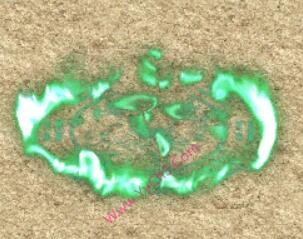   | 97     |
| 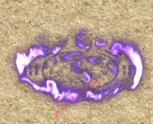   | 98     |
| 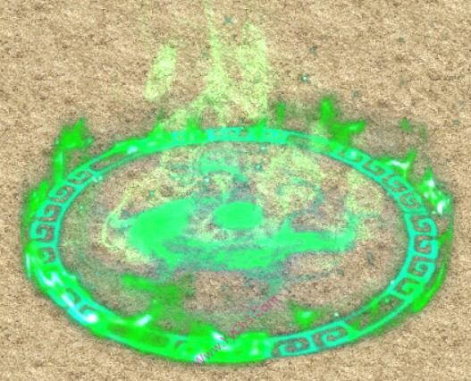   | 99     |
| 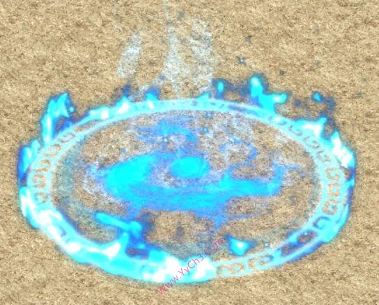  | 100    |
| 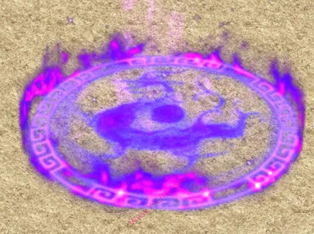  | 101    |
|   | 102    |
| 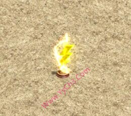  | 103    |
| 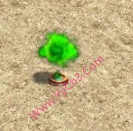  | 104    |
| 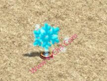  | 105    |
|   | 106    |
| 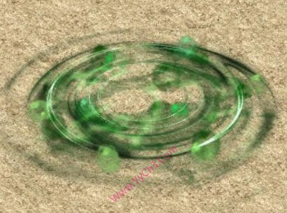  | 107    |
|   | 108    |
|   | 109    |
|   | 110    |
|   | 111    |
|   | 112    |
|   | 113    |
|   | 114    |
|   | 115    |
|   | 116    |
|   | 117    |
|   | 118    |
|   | 119    |
|   | 120    |
|   | 121    |
|   | 122    |
|   | 123    |
|   | 124    |
|   | 125    |
|   | 127    |
|   | 128    |
|   | 129    |
|   | 130    |
|   | 131    |
|   | 132    |
|   | 133    |
|   | 134    |
|   | 135    |
|   | 136    |
|   | 137    |
|   | 138    |
|   | 139    |
|   | 140    |
|   | 141    |
|   | 142    |
|   | 143    |
|   | 144    |
|   | 145    |
|   | 146    |
|   | 147    |
|   | 148    |
|   | 149    |
|   | 150    |
|   | 151    |
|   | 152    |
|   | 994    |
|   | 995    |
|  | 1001   |
|  | 1002   |
|  | 1003   |
|  | 1004   |
|  | 1005   |
|  | 1006   |
|  | 1007   |
|  | 1008   |
|  | 1009   |
|  | 1010   |
|  | 1011   |
|  | 1012   |
|  | 1013   |
