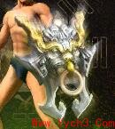
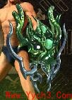

盾牌外观
===
```
盾牌外观设置的是物品数据库shape字段
```

|                         |        |           |                         |        |           |                         |        |           |
| :---------------------: | ------ | --------- | :---------------------: | ------ | --------- | :---------------------: | ------ | --------- |
|          **外观**         | **代码** | **Looks** |          **外观**         | **代码** | **Looks** |          **外观**         | **代码** | **Looks** |
|  | 76     | 1166      |  | 77     | 1167      |  | 78     | 1168      |
|  | 61     | 5193      |  | 62     | 5193      |  | 63     | 5193      |
|  | 67     | 5232      |  | 68     | 5232      |  | 69     | 5232      |
|  | 70     | 8115      |  | 71     | 8117      |  | 72     | 8116      |
|  | 73     | 30512     |  | 73     | 30512     |  | 73     | 30512     |
|  | 80     | 30501     |  | 80     | 30501     |  | 80     | 30501     |
