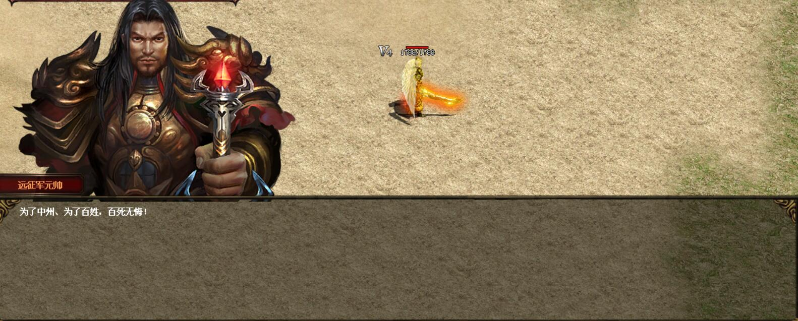
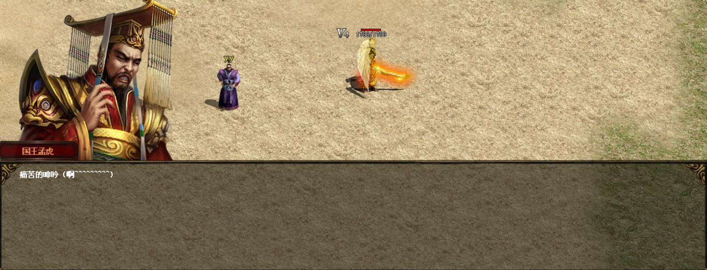
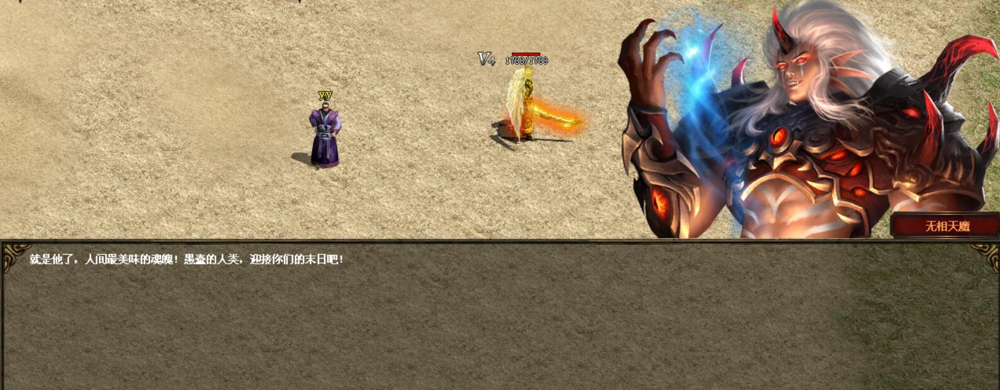
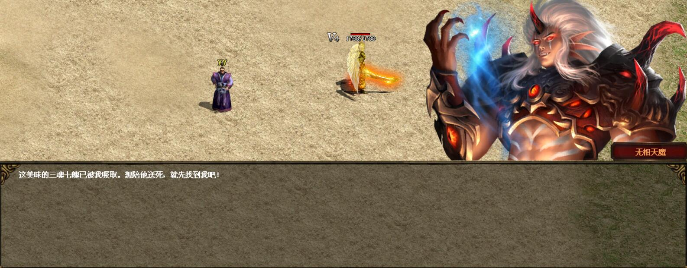
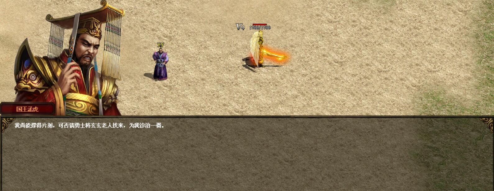
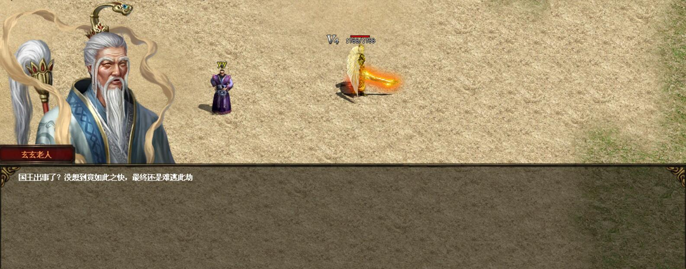
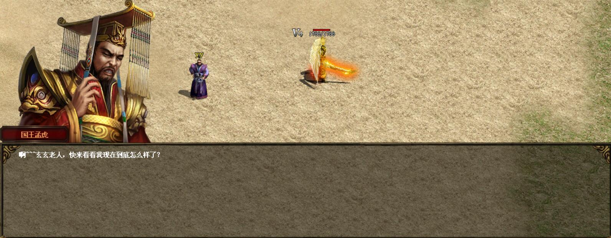
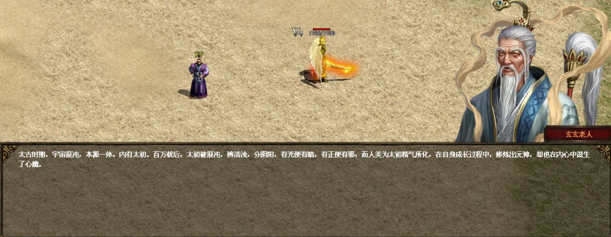
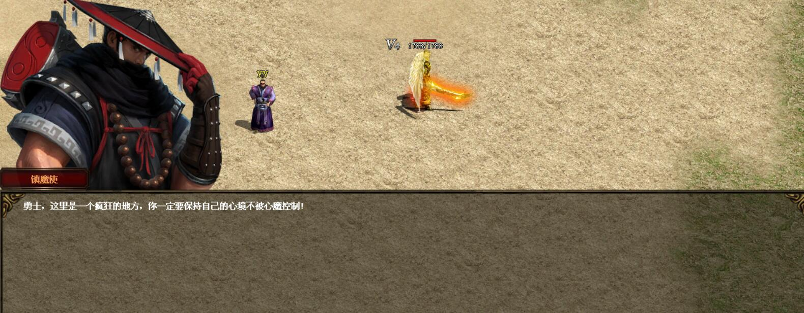
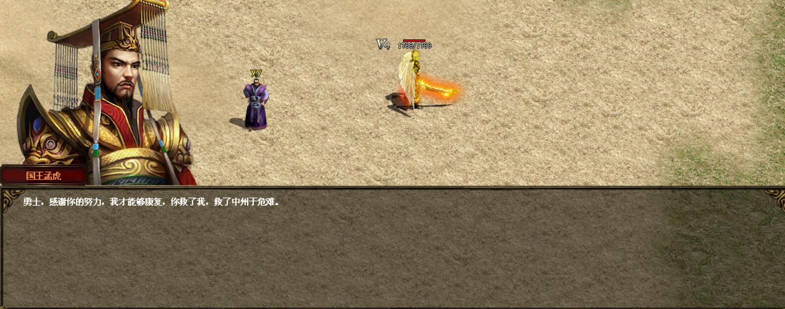

铁血魔城剧情动画
===

调用命令
```
#ACT
SHOWHUMEFFECT　345　x　0
x取值范围1-10，具体动画效果见下面:
```

| **效果代码**  | **图片效果**  |
|---|---|
| 1  |  |
| 2 |   |
| 3  |   |
| 4  |   |
| 5  |   |
| 6  |   |
| 7 |   |
| 8 |   |
| 9  |   |
| 10 |   |


