武器外观
===

```
请根据以下表格填写物品数据库"Shape"和"Feature"字段；

设置的Feature字段时，Shape则是套装代码，如果没有套装代码，请把Shape直接填写0。
```

战士、道士、法师、融合元神

|                        |             |               |                         |                 |
| ---------------------- | ----------- | ------------- | ----------------------- | --------------- |
|  **样式**                |  **shape**  |  **Feature**  |  **Looks**              |  备注         |
| 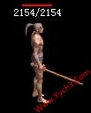   | 1       | 0         | 1                   |                 |
|    | 2       | 0         | 2                   |                 |
| 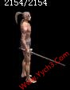   | 3       | 0         | 3                   |                 |
| 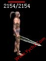   | 4       | 0         | 3                   |                 |
|    | 5       | 0         | 5                   |                 |
|    | 6       | 0         | 6                   |                 |
|    | 7       | 0         | 7                   |                 |
|    | 8       | 0         | 8                   |                 |
|    | 9       | 0         | 9                   |                 |
|   | 10      | 0         | 10                  |                 |
|   | 11      | 0         | 11                  |                 |
|   | 12      | 0         | 12                  |                 |
|   | 13      | 0         | 13                  |                 |
|   | 14      | 0         | 14                  |                 |
|   | 15      | 0         | 15                  |                 |
|   | 16      | 0         | 16                  |                 |
|   | 17      | 0         | 17                  |                 |
|   | 18      | 0         | 18                  |                 |
|   | 19      | 0         | 25                  |                 |
| 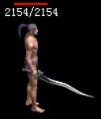  | 0       | 20        | 20                  | 设置Feature       |
|   | 21      | 0         | 21                  |                 |
|   | 22      | 0         | 22                  |                 |
|   | 23      | 0         | 23                  |                 |
|   | 24      | 0         | 24                  |                 |
|   | 25      | 0         | 25                  |                 |
|   | 26      | 0         | 26                  |                 |
|   | 27      | 0         | 27                  |                 |
|   | 28      | 0         | 28                  |                 |
|   | 29      | 0         | 29                  |                 |
|   | 30      | 0         | 30                  |                 |
|   | 31      | 0         | 31                  |                 |
|   | 32      | 0         | 32                  |                 |
|   | 33      | 0         | 33                  |                 |
|   | 34      | 0         | 34                  |                 |
|   | 35      | 0         | 35                  |                 |
|   | 36      | 0         | 36                  |                 |
|   | 37      | 0         | 37                  |                 |
|   | 38      | 0         | 38                  |                 |
|   | 39      | 0         | 39                  |                 |
|   | 40      | 0         | 144                 |                 |
|   | 41      | 0         | 246                 |                 |
| 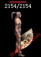  | 42      | 0         | 247                 |                 |
|   | 43      | 0         | 248                 |                 |
|   | 44      | 0         | 284                 |                 |
|   | 45      | 0         | 287                 |                 |
| 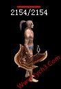  | 46      | 0         | 286                 |                 |
|   | 47      | 0         | 283                 |                 |
|   | 48      | 0         | 289                 |                 |
|   | 49      | 0         | 290                 |                 |
|   | 50      | 0         | 285                 |                 |
|   | 51      | 0         | 288                 |                 |
|   | 52      | 0         | 501                 |                 |
|   | 53      | 0         | 481                 |                 |
|   | 54      | 0         | 482                 |                 |
|   | 55      | 0         | 483                 |                 |
|   | 56      | 0         | 493                 |                 |
|   | 57      | 0         | 738                 |                 |
|   | 58      | 0         | 944                 |                 |
|   | 59      | 0         | 943                 |                 |
|   | 61      | 0         | 1155                |                 |
|   | 62      | 0         | 1156                |                 |
|   | 63      | 0         | 1157                |                 |
|   | 64      | 0         | 1165                |                 |
|   | 64      | 79        | 1161                |                 |
|   | 65      | 80        | 1162                |                 |
|   | 66      | 81        | 1163                |                 |
|   | 82      | 0         | 1195                |                 |
| 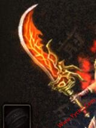  | 85      | 0         | 1412                | 融合元神            |
|   | 86      | 0         | 1413                | 融合元神            |
|   | 87      | 0         | 1414                | 融合元神            |
| 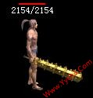  | 88      | 0         | 5243                |                 |
| 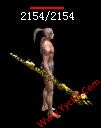  | 89      | 0         | 5244                |                 |
|   | 90      | 0         | 5245                |                 |
|   | 93      | 0         | 6630                |                 |
|   | 94      | 0         | 6631                |                 |
|   | 95      | 0         | 6632                |                 |
|   | 96      | 0         | 6010                |                 |
|   | 97      | 0         | 6011                |                 |
|   | 98      | 0         | 6012                |                 |
|  | 100     | 0         |                         |                 |
| 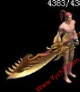 | 101     | 0         | 6930                | 融合元神            |
|  | 102     | 0         | 6931                | 融合元神            |
|  | 103     | 0         | 6932                | 融合元神            |
|  | 0       | 104       | 8057                | 设置Feature       |
|  | 0       | 105       | 8058                | 设置Feature       |
| 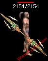 | 0       | 106       | 8059                | 设置Feature       |
|  | 0       | 110       | 8136                | 设置Feature       |
| 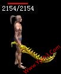 | 0       | 111       | 8137                | 设置Feature       |
|  | 0       | 112       | 8138                | 设置Feature       |
|  | 0       | 113       | 10501               | 设置Feature       |
|  | 0       | 114       | 10502               | 设置Feature       |
|  | 0       | 115       | 10503               | 设置Feature       |
| 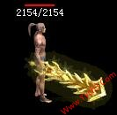 | 0       | 116       | 10625               | 设置Feature       |
| 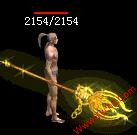 | 0       | 117       | 10626               | 设置Feature       |
|  | 0       | 118       | 10627               | 设置Feature       |
|  | 0       | 120       | 10695               | 设置Feature       |
|  | 0       | 121       | 10696               | 设置Feature       |
|  | 0       | 122       | 10697               | 设置Feature       |
|  | 0       | 123       | 10795               | 设置Feature       |
|  | 0       | 124       | 10796               | 设置Feature       |
|  | 0       | 125       | 10797               | 设置Feature       |
|  | 127     | 0         | 26100               | 融合元神            |
|  | 128     | 0         | 26101               | 融合元神            |
| 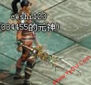 | 129     | 0         | 26102               | 融合元神            |
|  | 0       | 130       | 26131               | 设置Feature       |
|  | 0       | 131       | 26132               | 设置Feature       |
|  | 0       | 132       | 26133               | 设置Feature       |
|  | 0       | 133       | 26204               | 设置Feature       |
| 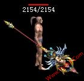 | 0       | 134       | 26214               | 设置Feature       |
|  | 0       | 135       | 26224               | 设置Feature       |
|  | 0       | 136       | 26304               | 设置Feature       |
|  | 0       | 137       | 26314               | 设置Feature       |
| 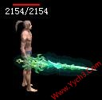 | 0       | 138       | 26324               | 设置Feature       |
| 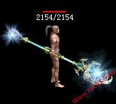 | 0       | 140       | 26413               | 设置Feature       |
|  | 0       | 141       | 26423               | 设置Feature       |
|  | 0       | 142       | 30307               | 设置Feature       |
|  | 0       | 143       | 30325               | 设置Feature       |
| 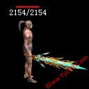 | 0       | 144       | 30336               | 设置Feature       |
| 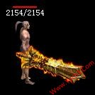 | 0       | 145       | 30407               | 设置Feature       |
| 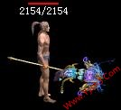 | 0       | 146       | 30425               | 设置Feature       |
|  | 0       | 147       | 30436               | 设置Feature       |
| 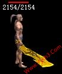 | 0       | 160       | 30646               | 设置Feature       |
|  | 0       | 161       | 30648               | 设置Feature       |
|  | 0       | 162       | 30647               | 设置Feature       |
| 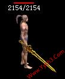 | 0       | 163       | 30649               | 设置Feature       |
|  | 0       | 164       | 30642               | 设置Feature       |
|  | 0       | 165       | 30643               | 设置Feature       |
|  | 0       | 166       | 30644               | 设置Feature       |
|  | 167     | 0         | 1546                | shape和Feature一样 |
| 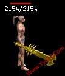 | 168     | 0         | 1548                | shape和Feature一样 |
| 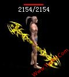 | 169     | 0         | 1549                | shape和Feature一样 |
|  | 0       | 170       | 8578                | 设置Feature       |
|  | 0       | 171       | 8579                | 设置Feature       |
|  | 0       | 172       | 8580                | 设置Feature       |
|  | 0       | 173       | 11142               | 设置Feature       |
|  | 0       | 174       | 11143               | 设置Feature       |
|  | 0       | 175       | 11144               | 设置Feature       |
|  | 0       | 176       | 26587               | 设置Feature       |
|  | 0       | 177       | 26585               | 设置Feature       |
|  | 0       | 178       | 26584               | 设置Feature       |
|  | 0       | 179       | 26606               | 设置Feature       |
| 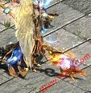 | 0       | 180       | 26616               | 设置Feature       |
|  | 0       | 181       | 26626               | 设置Feature       |
|  | 0       | 182       | 26697               | 设置Feature       |
|  | 0       | 183       | 26698               | 设置Feature       |
|  | 0       | 184       | 26697               | 设置Feature       |
|  | 0       | 185       | 26697               | 设置Feature       |
| 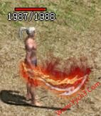 | 0       | 186       | 26698               | 设置Feature       |
|  | 0       | 187       | 26698               | 设置Feature       |
|  | 0       | 188       | 26806               | 设置Feature       |
| 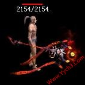 | 0       | 189       | 26816               | 设置Feature       |
|  | 0       | 190       | 26826               | 设置Feature       |
|  | 0       | 191       | 26859               | 设置Feature       |
|  | 0       | 192       | 26860               | 设置Feature       |
|  | 0       | 193       | 26861               | 设置Feature       |
| 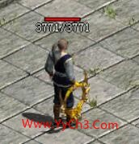 | 0       | 194       | 26098               | 设置Feature       |
| 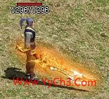 | 0       | 195       | 25703               | 设置Feature       |
| 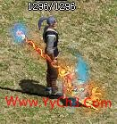 | 0       | 196       | 25713               | 设置Feature       |
|  | 0       | 197       | 25723               | 设置Feature       |
|  | 0       | 199       | 26083               | 设置Feature       |
|  | 0       | 200       | 26084               | 设置Feature       |
| 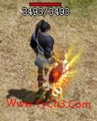 | 0       | 201       | 26085               | 设置Feature       |
| 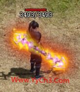 | 0       | 202       | 26086               | 设置Feature       |
|  | 0       | 203       | 对照物品外观11300-11310设置 | 设置Feature       |
| 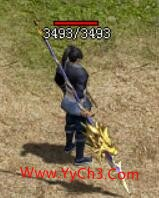 | 0       | 204       | 对照物品外观11300-11310设置 | 设置Feature       |
|  | 0       | 205       | 对照物品外观11300-11310设置 | 设置Feature       |
| 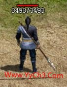 | 0       | 206       | 对照物品外观11300-11310设置 | 设置Feature       |
| 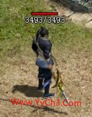 | 0       | 207       | 对照物品外观11300-11310设置 | 设置Feature       |
| 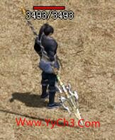 | 0       | 208       | 对照物品外观11300-11310设置 | 设置Feature       |
| 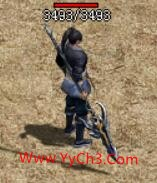 | 0       | 209       | 对照物品外观11300-11310设置 | 设置Feature       |
| 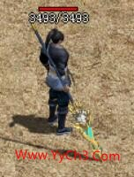 | 0       | 210       | 对照物品外观11300-11310设置 | 设置Feature       |
| 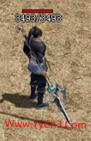 | 0       | 211       | 对照物品外观11300-11310设置 | 设置Feature       |
| 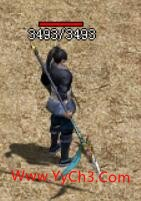 | 0       | 212       | 对照物品外观11300-11310设置 | 设置Feature       |
| 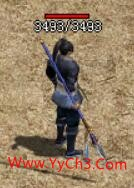 | 0       | 213       | 对照物品外观11300-11310设置 | 设置Feature       |
|  | 0       | 215       | 对照物品外观11300-11310设置 | 设置Feature       |
|  | 0       | 216       | 30094               | 设置Feature       |
| 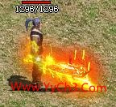 | 0       | 217       | 30092               | 设置Feature       |
| 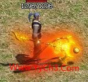 | 0       | 218       | 30093               | 设置Feature       |
|  | 0       | 226       | 11503               | 设置Feature       |
| 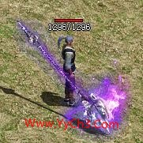 | 0       | 227       | 11513               | 设置Feature       |
| 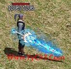 | 0       | 228       | 11523               | 设置Feature       |
| 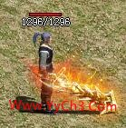 | 0       | 229       | 10625               | 设置Feature       |
| 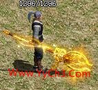 | 0       | 230       | 10626               | 设置Feature       |
|  | 0       | 231       | 10627               | 设置Feature       |
| 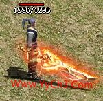 | 0       | 232       | 25761               | 设置Feature       |
|  | 0       | 233       | 25762               | 设置Feature       |
| 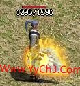 | 0       | 234       | 25763               | 设置Feature       |
|  | 0       | 235       | 25603               | 设置Feature       |
|  | 0       | 236       | 25613               | 设置Feature       |
|  | 0       | 237       | 25623               | 设置Feature       |
|  | 0       | 239       | 25503               | 设置Feature       |
|  | 0       | 240       | 25513               | 设置Feature       |
|  | 0       | 241       | 25523               | 设置Feature       |
|  | 0       | 242       | 25543               | 设置Feature       |
|  | 0       | 243       | 25550               | 设置Feature       |
|  | 0       | 244       | 25551               | 设置Feature       |
|  | 0       | 245       | 25552               | 设置Feature       |
|  | 0       | 250       | 10130               | 设置Feature       |
|  | 0       | 251       | 10131               | 设置Feature       |
|  | 0       | 252       | 10132               | 设置Feature       |
|  | 0       | 253       | 25403               | 设置Feature       |
|  | 0       | 254       | 25413               | 设置Feature       |
|  | 0       | 255       | 25423               | 设置Feature       |
|  | 0       | 279       | 25562               | 设置Feature       |
|  | 0       | 280       | 25563               | 设置Feature       |
|  | 0       | 281       | 25564               | 设置Feature       |
|  | 0       | 282       | 25568               | 设置Feature       |
|  | 0       | 283       | 25569               | 设置Feature       |
|  | 0       | 284       | 25570               | 设置Feature       |
|  | 0       | 285       | 25673               | 设置Feature       |
|  | 0       | 286       |                         | 设置Feature       |
|  | 0       | 287       |                         | 设置Feature       |
|  | 0       | 288       |                         | 设置Feature       |
|  | 0       | 289       |                         |                 |
|  | 0       | 290       |                         | 设置Feature       |
|  | 0       | 291       |                         | 设置Feature       |
|  | 0       | 298       | 25335               | 设置Feature       |
|  | 0       | 299       | 25345               | 设置Feature       |
|  | 0       | 300       | 25355               | 设置Feature       |
|  | 0       | 301       | 25365               | 设置Feature       |
|  | 0       | 302       |                         |                 |
|  | 0       | 303       |                         |                 |
|  | 0       | 304       |                         |                 |

*

妖士

|                        |       |         |             |
| ---------------------- | ----- | ------- | ----------- |
| **样式**                 | **Shape** | **Feature** | **Looks**   |
|   | 0     | 1       | 10101       |
|   | 0     | 2       | 10102       |
|   | 0     | 3       | 10103       |
|   | 0     | 4       | 10104       |
|   | 0     | 5       | 10105       |
|   | 0     | 6       | 10106       |
|   | 0     | 7       | 10107       |
|   | 0     | 8       | 10108       |
|   | 0     | 9       | 10109       |
|  | 0     | 10      | 10110       |
|  | 0     | 11      | 10111       |
|  | 0     | 12      | 10112       |
|  | 0     | 13      | 10380       |
|  | 0     | 14      | 10504       |
|  | 0     | 15      | 10628       |
|  | 0     | 16      | 10698       |
|  | 0     | 17      | 10798       |
|  | 0     | 18      | 26134、26334 |
|  | 0     | 19      | 26234       |
|  | 0     | 21      | 30355       |
|  | 0     | 22      | 30454       |
|  | 0     | 23      | 30645       |
|  | 0     | 24      | 1547        |
|  | 0     | 25      | 8581        |
|  | 0     | 26      | 26586       |
|  | 0     | 27      | 26636       |
|  | 0     | 29      | 25733       |
