角色羽翼外观
===


```
命令
SETREPRESSDEMONWINGLOOK　A
```

|           |                   |
| --------- | ----------------- |
| **A参数代码** | **外观样式**          |
| 1     | 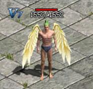   |
| 2     | 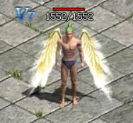   |
| 3     | 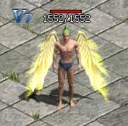   |
| 4     | 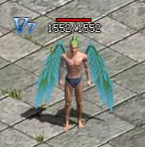   |
| 5     | 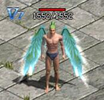   |
| 6     | 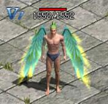   |
| 7     | 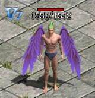   |
| 8     | 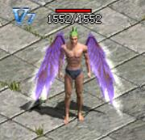   |
| 9     | 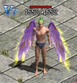   |
| 10    | 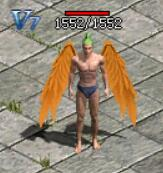  |
| 11    | 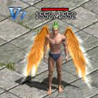  |
| 12    | 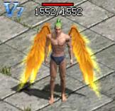  |
| 13    | 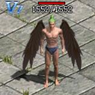  |
| 14    | 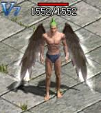  |
| 15    | 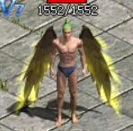  |
| 100   | 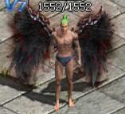 |
| 101   | 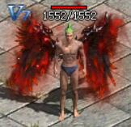 |
| 102   | 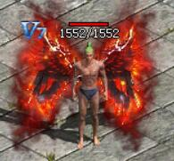 |
| 103   | 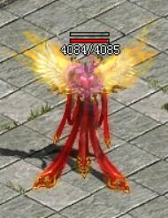 |
| 104   | 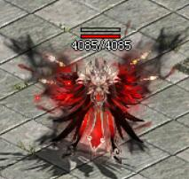 |
| 105   | 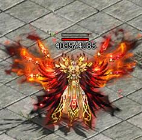 |
| 106   | 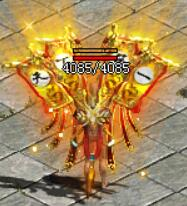 |
| 107   | 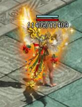 |
| 108   | 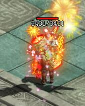 |
| 109   | 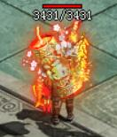 |
| 110   | 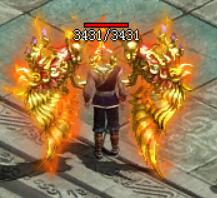 |
| 111   | 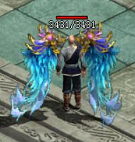 |
| 112   | 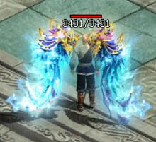 |
| 113   | 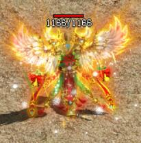 |
| 114   | 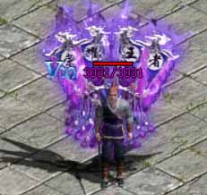 |
| 115   | 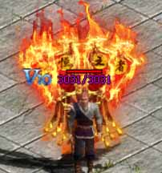 |
| 116   | 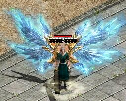 |
| 117   | 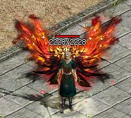 |
| 118   | 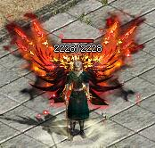 |
| 119   | 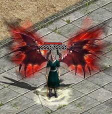 |
| 120   | 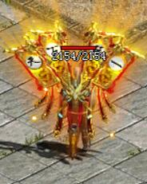 |
| 121   | 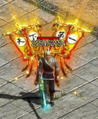 |
| 122   | 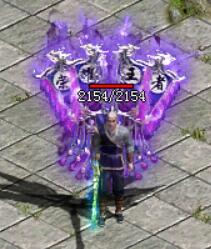 |
| 123   | 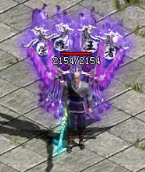 |
| 124       | 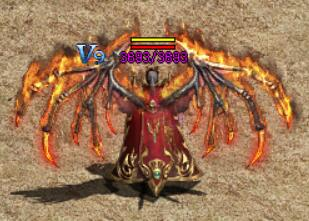 |
| 125       | 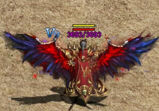 |


说明

官方在最新的客户端增加羽翼系统，取消了绿色封号的翅膀，请使用此命令设置人物翅膀。

使用此命令设置翅膀后，还要手动选择显示翅膀，否则游戏内不显示的。方法：F12--系统设置--个性设置--社会关系--勾选"显示翅膀"，确定即可。

如图：

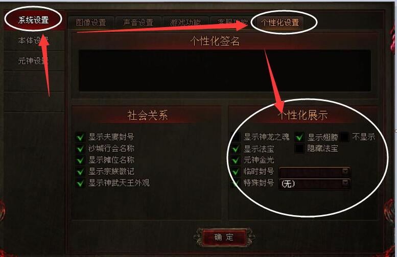


使用示例:
```
[@例]
#IF
CHECKJOB WARR
CHECKLEVELEX = 46
#ACT
FENGHAO 1 战将
SETREPRESSDEMONWINGLOOK 1
break
#IF
CHECKJOB WIZARD
CHECKLEVELEX = 46
#ACT
FENGHAO 1 法魂
SETREPRESSDEMONWINGLOOK 1
break
#IF
CHECKLEVELEX < 46
#ACT
break
#IF
CHECKJOB TAOIST
CHECKLEVELEX = 46
#ACT
FENGHAO 1 道玄
SETREPRESSDEMONWINGLOOK 1
break
```